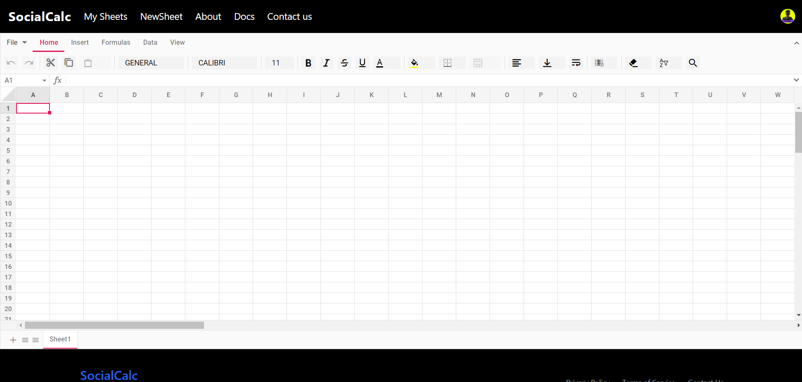
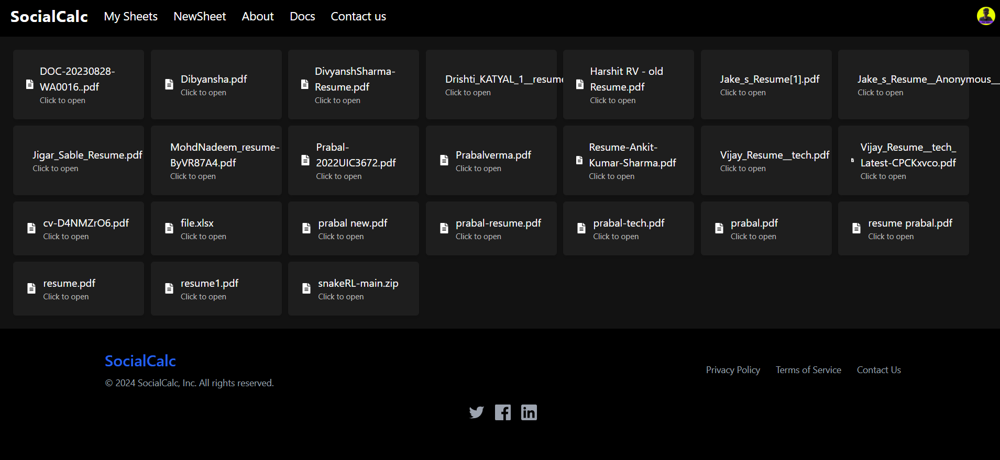
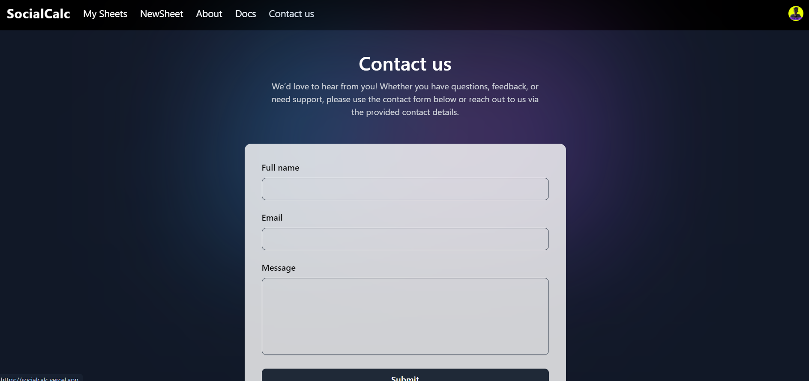

## Tasks Accomplished

- [x] **Task 1:** Implemented basic spreadsheet functionality using Syncfusion for a smooth user experience.
- [x] **Task 2:** Integrated Clerk for secure user authentication and registration and working to implement NextAuth.
- [x] **Task 3:** Set up Firebase for file storage and retrieval, enabling seamless file management.
- [x] **Task 4:** Containerized the application for easier deployment and scalability using Docker.
- [x] **Task 5:** Added email functionalities for contact forms and password recovery features.
- [x] **Task 6:** Planned scaling of the application using AWS EC2 clusters to ensure performance under high loads.

## Technology Stack

This project leverages the following technologies:

- **[React](https://reactjs.org):** Used for building the user interface due to its component-based architecture and strong community support.
- **[Next.js](https://nextjs.org):** Chosen for its server-side rendering capabilities, which improve SEO and performance.
- **[Tailwind CSS](https://tailwindcss.com):** Used for styling, offering a highly customizable and responsive design system with utility-first classes.
- **[Node.js](https://nodejs.org):** A JavaScript runtime environment that handles server-side operations and is known for its efficiency and scalability.
- **[Firebase](https://firebase.google.com):** Provides real-time database and storage capabilities, essential for managing and storing files.
- **[Syncfusion](https://www.syncfusion.com):** A UI component library used to implement spreadsheet functionality, enhancing user interactivity.
- **[Clerk](https://clerk.dev):** Used for authentication and managing user sessions, ensuring a secure environment.
- **[Docker](https://www.docker.com):** Enables containerization of the application for consistent deployment across different environments.

## Key Features

- **Real-time Spreadsheet Functionality:** Allows users to edit and manipulate data in a familiar spreadsheet interface.
- **Secure User Authentication:** Provides a robust login and registration system with Clerk.
- **File Storage and Retrieval:** Uses Firebase for seamless storage and management of user files.
Here's the expanded template with your provided steps for running the project locally:


# UI
### HOME PAGE

### LOGIN PAGE

### NEWSHEET PAGE

### MYSHEET PAGE

### CONTACT US PAGE


---

## Steps to Run the Project Locally

1. **Clone the Repository:**
   ```bash
   git clone https://github.com/Prabal-verma/SIH_INTERNAL_ROUND_1_NERD_NINZAS
   cd SIH_INTERNAL_ROUND_1_NERD_NINZAS/code/SocialCalc-SIH
   ```

2. **Install Dependencies:**
   Install the necessary Node.js dependencies for the project.
   ```bash
   npm install
   ```

3. **Setup Environment Variables:**
   Create a `.env` file in the root directory of the project with the following configurations:
   ```env
   MONGODB_URI=your_mongodb_connection_string
   FIREBASE_CONFIG=your_firebase_configuration
   CLERK_FRONTEND_API=your_clerk_frontend_api_key
   ```
   - **MONGODB_URI**: The connection string to connect to your MongoDB database.
   - **FIREBASE_CONFIG**: Firebase configuration details required for storage and authentication services.
   - **CLERK_FRONTEND_API**: API key for Clerk authentication integration.

4. **Run the Application:**
   Start the application in development mode using:
   ```bash
   npm run dev
   ```

5. **Access the Application:**
   Once the server is running, open your web browser and go to:
   ```
   http://localhost:3000
   ```
   to access the application.

6. **Docker Setup (Optional):**
   If you prefer to run the project in a Docker container:
   - **Build the Docker image**:
     ```bash
     docker build -t your_image_name .
     ```
   - **Run the Docker container**:
     ```bash
     docker run -p 3000:3000 your_image_name
     ```

7. **Scaling with AWS EC2 (Future Plans):**
   - Plan to use AWS EC2 clusters to scale the application in production environments.
   - Implement auto-scaling policies to dynamically adjust the number of instances based on workload requirements.

## Contact

For any queries or further information, feel free to reach out to the team leader:

- **Prabal Verma**  
  GitHub: [@Prabal-verma](https://github.com/Prabal-verma)  
  Email: Prabalverma@gmail.com  
