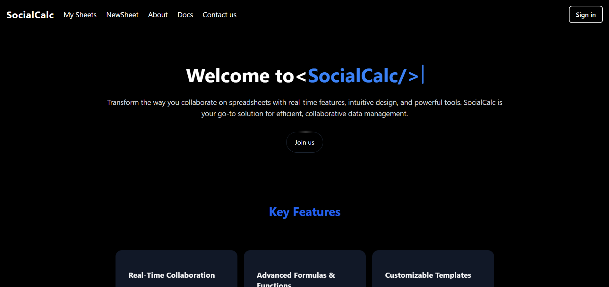
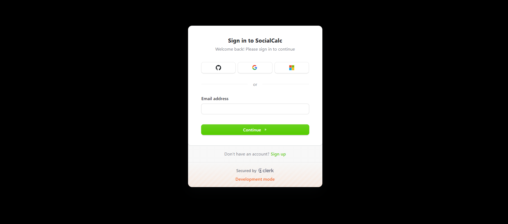

Here's a template for your SocialCalc app's README file:

---

# SocialCalc

SocialCalc is a modern, web-based spreadsheet application designed for real-time collaboration. Inspired by the classic SocialCalc, this project aims to provide an intuitive and powerful spreadsheet experience with live collaboration capabilities.

# UI
### HOME PAGE

### LOGIN PAGE

### PRIVACY PAGE


## Features

- **Real-Time Collaboration**: Work on spreadsheets simultaneously with your team.
- **User Authentication**: Secure login and user management powered by Clerk.
- **Scalability**: Built with performance and scalability in mind to handle large datasets and multiple users.
- **Modern UI/UX**: Sleek and professional design using Tailwind CSS.
- **Persistence**: Data storage and retrieval using MongoDB with Mongoose.
- **Version Control**: Keep track of changes and revert to previous versions as needed.

## Tech Stack

- **Frontend**: React.js, Next.js, Tailwind CSS
- **Backend**: Node.js, Express.js
- **Database**: MongoDB with Mongoose
- **Authentication**: Clerk
- **Other Technologies**: WebSockets for real-time updates, Docker for containerization

## Installation

To set up the project locally, follow these steps:

1. **Clone the repository:**

   ```bash
   git clone https://github.com/Prabal-verma/SocialCalc-SIH
   cd socialCalc-SIH
   ```

2. **Install dependencies:**

   ```bash
   npm install
   ```

3. **Set up environment variables:**

   Create a `.env` file in the root directory and add the following:

   ```plaintext
   MONGO_URI=your_mongodb_uri
   CLERK_API_KEY=your_clerk_api_key
   NEXT_PUBLIC_CLERK_FRONTEND_API=your_clerk_frontend_api
   ```

4. **Run the development server:**

   ```bash
   npm run dev
   ```

   The app should now be running at `http://localhost:3000`.

## Usage

1. **Sign Up / Log In**: Use the Clerk authentication to create an account or log in.
2. **Create a Spreadsheet**: Start a new spreadsheet or open an existing one.
3. **Collaborate**: Share the spreadsheet link with team members to collaborate in real-time.

## Contributing

We welcome contributions from the community! Here's how you can get involved:

1. Fork the repository
2. Create a new branch (`git checkout -b feature/your-feature`)
3. Make your changes
4. Commit your changes (`git commit -m 'Add some feature'`)
5. Push to the branch (`git push origin feature/your-feature`)
6. Open a pull request

Please make sure to update tests as appropriate.

## License

This project is licensed under the MIT License. See the [LICENSE](LICENSE) file for details.

## Contact

If you have any questions, feel free to reach out:

- **Nerd Ninzas** - nerdninzas@gmail.com

---

Feel free to customize the content according to your specific setup and preferences.